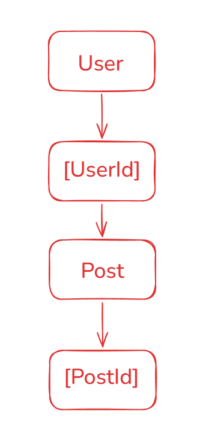
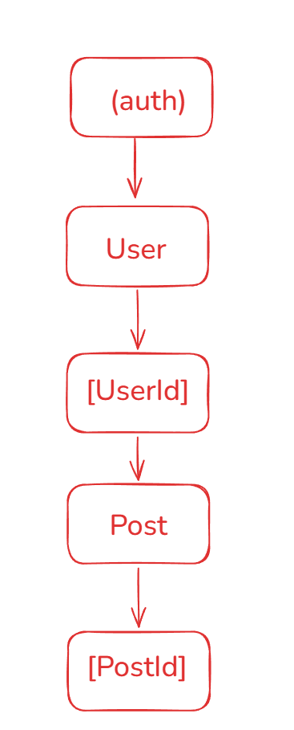
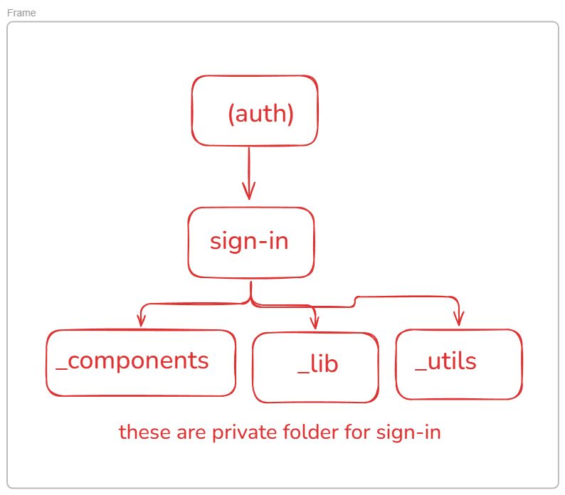
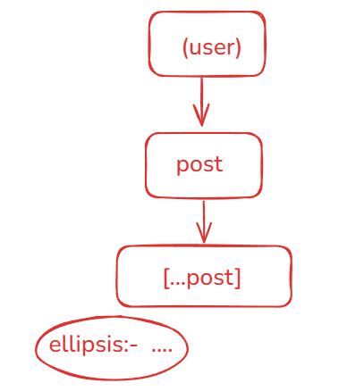
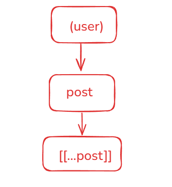
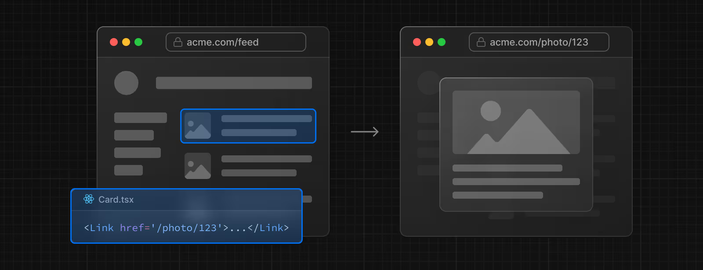
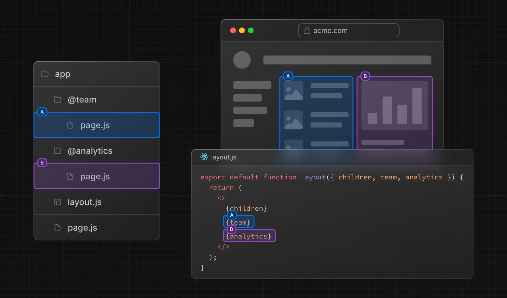
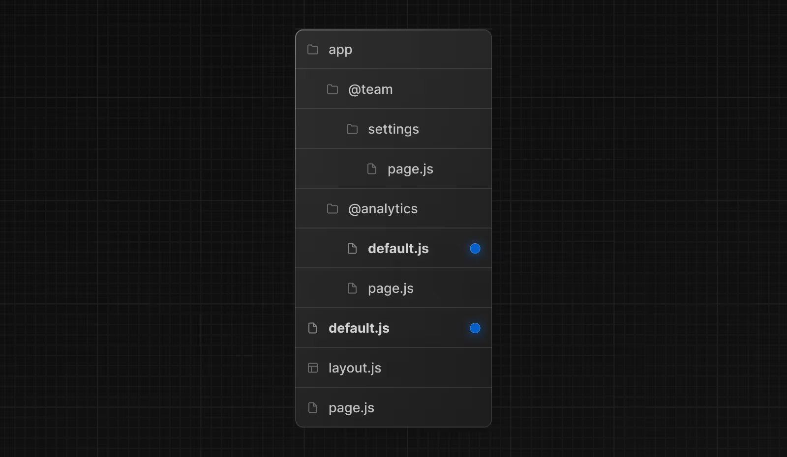

## Dynamic nested routing

we use params to access the id's of the nested routing
const {userId, postId} =await params;

### Limitation of Dynamic nested routing:-

Fixed depth and Rigit Structure

## Route group

It is use for organization purpose only and will not effect url 
Benefits:- 
Clean url 
Modular layout 
Improve maintainabity 

layout.jsx:- in out most of the code we write goes here so that it can be reused by other components or pages as well.

## Private folder

Folder prefixed state with underscore ( like _components, _utils, _lib, etc) will not be visible to user but will only be used for internal purpose and hence should not be exposed to the public.

## Catch-All segments

To handle routes with varies number of segment we use catch-all segement. 
It capture all subsegments that are passed in url into a single array parameter. 
It is used to make it future proof by allowing any number of additional path parameters to be captured as well. 

For example, pages/shop/[...slug].js will match /shop/clothes, but also /shop/clothes/tops, /shop/clothes/tops/t-shirts, and so on. `but not match /shop.`

## Optional Catch-All

Catch-all Segments can be made optional by including the parameter in double square brackets: [[...segmentName]].

For example, pages/shop/[[...slug]].js `will also match /shop`, in addition to /shop/clothes, /shop/clothes/tops, /shop/clothes/tops/t-shirts.

## Intercepting Routes

Intercepting routes allows you to load a route from another part of your application within the current layout.  
eg when we login a pop up open for login in same Layout blurring  background and so on...

However, when navigating to the login by clicking a shareable URL or by refreshing the page, the entire login page should render instead of the modal. No route interception should occur.

### Conversion
Intercepting routes can be defined with the (..) convention, which is similar to relative path convention ../ but for route segments.

You can use:

(.) to match segments on the same level 
(..) to match segments one level above 
(..)(..) to match segments two levels above 
(...) to match segments from the root app directory 

## Parallel Routes

Parallel Routing allows you to simultaneously or conditionally render one or more pages in the same layout. For highly dynamic sections of an app, such as dashboards and feeds on social sites.

Parallel routes are created using named slots. Slots are defined with the @folder convention, and are passed to the same-level layout as props.

### Challenges
Performing a full page reload, causing nextjs to lose the active state of slots 
Navigate to a route that doesn't have a corresponding page in a slot. 

### Unmatched Routes

By default, the content rendered within a slot will match the current URL.

In the case of an unmatched slot, the content that Next.js renders differs based on the routing technique and folder structure.

`default.js`
You can define a default.js file to render as a fallback when Next.js cannot recover a slot's active state based on the current URL.

### Navigation
On navigation, Next.js will render the slot's previously active state, even if it doesn't match the current URL.

### Reload
On reload, Next.js will first try to render the unmatched slot's default.js file. If that's not available, a 404 gets rendered.

## Page Not found

Global:-
Inside app create a not-found.jsx page 

Specific:-
Inside each folder create a not-found.jsx page with custom message and so on...

